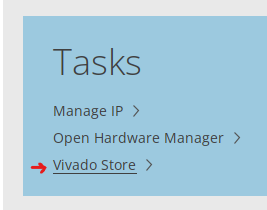
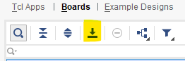

# fpga-hil
This repository is for the development and verification for the modules of a Zybo Z7-20 FPGA.  
The aim is to create an HIL (Hardware in the Loop) platform.

## Requirements
- Python 3
- Vivado 2025.2
- VSCode

**Important**  
For Vivado, you need to download the board files for the Zybo Z7-20. To do this, do the following:
1. Open Vivado  
2. Click on `Vivado Store`  
  
3. In the store, make sure to press the `Refresh` button at the bottom of the window. This will fetch the missing board and download them. Not doing this step may result in the Zybo Z7-20 board missing. Wait for this process to finish.
4. Select the `Boards` tab then select the board in the tree below:  
Digilent Inc > Single Part > Zybo Z7-20
5. Make sure the board is selected, then press the download button  

6. Wait for the download to finish then you are ready to go.

## Project Setup
1. Clone the project using the following command in the parent directory:  
`git clone https://github.com/samsim97/fpga-hil.git`
2. If on Windows, run:  
`bootstrap.bat`  
If on Linux, run:  
`bootstrap.sh`
